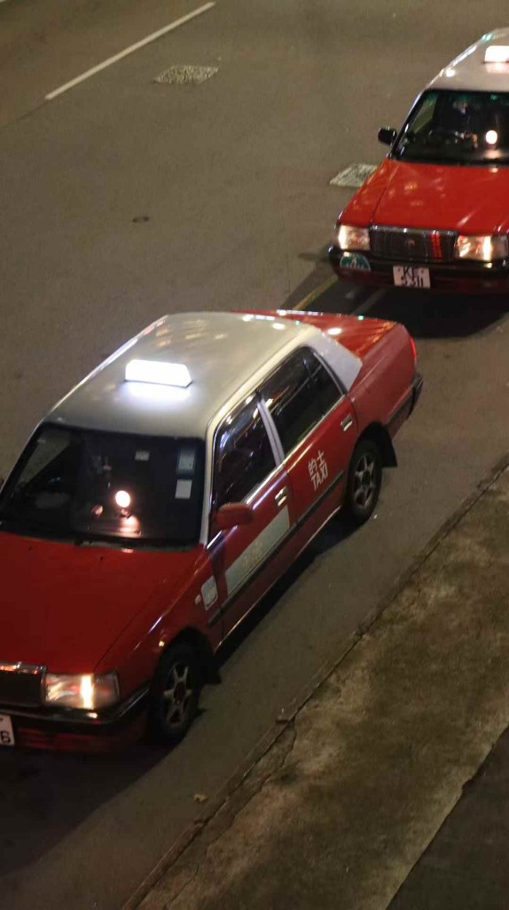

# 🎬 Wong Kar-wai Lens (王家卫镜头 / 港影工坊)

<p align="center">
  <b>把日常照片重塑为 1990 年代香港真实胶片快门与王家卫电影质感作品</b><br>
  <i>Transform everyday photos into authentic 1990s Hong Kong cinematic art & candid film snapshots.</i>
</p>

<p align="center">
  
  
  
  
  
</p>

---

## 🌟 核心特性 (Key Features)

- 📸 **全画幅纯净无遮挡（Full-Bleed & Clean）**：去除生硬黑边与多余元素，完整保留真实构图与胶片氛围。
- 🌅 **通透平滑的 90s 胶片影调（Continuous Color Science）**：采用严格单调连续的胶片调色曲线，**100% 杜绝色阶断层、杂色坏斑与假打光**。
- ⏳ **90s 经典胶卷相机时间戳（Delicate Yellow Timestamp）**：角落点缀精致微小的 LCD/LED 怀旧时间码（如 `'95 11 12`）。
- ✍️ **王家卫语录生成引擎（Monologue Engine）**：多模态大模型（VLM）提示词驱动，自动生成包含“精确时间戳 + 微观空间距离 + 保质期隐喻”的王家卫式电影旁白。
- 🤖 **全能复合生态**：既是可直接接入 **Antigravity / Claude Code / Cursor / GPTs** 的标准 `SKILL.md`，也是无需付费 API 的**纯本地 Python 命令行工具**。

---

## 🖼️ 官方实战展厅 · 经典前后对比 (Before & After Showcase)

### 🚕 经典呈现 · 《弥敦道 · 红色的士》 (HK Red Taxis at Night)

<div align="center">
  <table>
    <tr>
      <th width="50%" align="center">📷 原始日常实拍 (Original Photo)</th>
      <th width="50%" align="center">🎞️ 港风胶片重塑 (WKW Film Grade)</th>
    </tr>
    <tr>
      <td align="center"></td>
      <td align="center"></td>
    </tr>
  </table>
</div>

> **【时间坐标】** `'95 11 12`  
> **【王家卫独白】** “在香港，每天有两万四千辆红色的士在路上跑。从尖沙咀到旺角，总共要拐十四个弯。那天晚上，我和前面那辆车最近的时候，距离只有两米。后来绿灯亮了，它向左转，我向右转。”  
> **【视觉重塑特点】**：
> * **青冷沥青暗部**：深冷青蓝夜色柏油路面，还原《堕落天使》《重庆森林》的迷离午夜质感。
> * **浓郁朱红车漆**：经典香港皇冠红色出租车车漆层次鲜活、富有胶片厚重感。
> * **发光车顶灯与时间码**：车顶灯微红晕（Halation）漫射，左上角点缀极简微小的黄色 `'95 11 12` 时间印记。

---

## 🚀 快速上手 (Quick Start)

### 1. 一键安装 (Installation)

#### 方式 A：通过 Git 直接安装（推荐）
```bash
git clone https://github.com/bazz1111/wkw-lens.git
cd wkw-lens
pip install -e .
```

#### 方式 B：极简依赖安装
```bash
pip install pillow numpy
```

---

### 2. 命令行一键出片 (CLI Usage)

安装完成后，可直接在终端使用全局命令 `wkw-lens` 或 `python -m src.cli`：

#### 🌟 基础用法：全画幅纯净胶片（带经典时间戳）
```bash
wkw-lens my_photo.jpg -t "'95 11 12"
```

#### 🚕 夜景与街景模式（增强深青与浓郁红调）
```bash
wkw-lens taxi.jpg -s night -t "'95 11 12" --pos top-left
```

#### 🎞️ 渲染 35mm 柯达胶卷齿孔画框
```bash
wkw-lens photo.jpg -f film -o my_film_still.jpg
```

#### 🎬 渲染 2.39:1 电影宽荧幕与双语字幕
```bash
wkw-lens photo.jpg -f cinema -zh "有些事情你想留是留不住的" -en "SOME THINGS YOU CANNOT KEEP"
```

#### ⚙️ CLI 参数完整列表
| 参数 | 缩写 | 可选值 | 说明 |
| :--- | :--- | :--- | :--- |
| `--style` | `-s` | `wkw`, `night`, `romance` | 影调预设：`wkw`（通用经典）, `night`（夜景/出租车）, `romance`（温润文艺） |
| `--frame` | `-f` | `none`, `film`, `cinema` | 画框排版：`none`（全画幅）, `film`（35mm胶卷框）, `cinema`（宽荧幕字幕） |
| `--timestamp` | `-t` | 文本 / `'none'` | 黄色复古时间戳（如 `"'95 11 12"`，传 `'none'` 可关闭） |
| `--pos` | | `top-left`, `top-right`, `bottom-right` | 时间戳位置（默认: `top-left`） |
| `--chinese` | `-zh` | 文本 | 中文字幕内容（仅在 `-f cinema` 下生效） |
| `--english` | `-en` | 文本 | 英文字幕内容（仅在 `-f cinema` 下生效） |

---

### 3. 在 Python 代码中使用 (Python API)

```python
from PIL import Image
from src.color_grading import grade_image
from src.candid_processor import add_delicate_timestamp

# 打开照片并进行港风夜景调色
img = Image.open("taxi.jpg")
graded = grade_image(img, style="night")

# 添加 90s 复古时间戳
final_img = add_delicate_timestamp(graded, timestamp_str="'95 11 12", position="top-left")
final_img.save("output_taxi_wkw.jpg", quality=98)
```

---

## 🤖 作为 AI Agent Skill 使用

本项目根目录下的 [`SKILL.md`](SKILL.md) 遵循 **Antigravity / Claude Code / Cursor / Open-Agents** 标准规范。

### 如何接入你的 Agent：
1. **Antigravity / Open-Agents**：将本仓库 clone 到 Agent 的 skills 目录下，或在对话中直接 `@wong-kar-wai-lens`。
2. **Claude Code / Cursor**：直接在配置中将 `SKILL.md` 作为 Rule 或 Skill 引用。
3. **调用示例**：
   > *“请调用 wong-kar-wai-lens skill，分析我刚上传的这张香港街景照片，生成一段王家卫式的内心独白，并按金标规范输出 90s 胶片调色成片。”*

---

## 📂 项目结构 (Repository Structure)

```text
wkw-lens/
├── README.md                  # 中英双语项目介绍与官方展厅
├── SKILL.md                   # Agent Skill 标准规范定义
├── LICENSE                    # MIT 开源协议
├── setup.py                   # pip 一键安装配置
├── requirements.txt           # Python 依赖
├── prompts/                   # 提示词库
│   ├── wkw_monologue.md       # 多模态 VLM 台词生成规则与 Few-shot 示例
│   ├── image_to_image.md      # Midjourney / Flux / SD 港风重绘咒语
│   └── director_presets.md    # 导演风格矩阵（王家卫 / 杜琪峰 / 经典文艺）
├── src/                       # 核心渲染引擎
│   ├── __init__.py
│   ├── cli.py                 # wkw-lens 命令行工具入口
│   ├── color_grading.py       # 连续平滑无断层色彩分级引擎
│   ├── candid_processor.py    # 时间戳与自然胶片快门渲染器
│   ├── film_effects.py        # 35mm 胶片微微粒与光学漫射
│   ├── frame_renderer.py      # 2.39:1 CinemaScope 与 35mm 齿孔胶卷框生成
│   ├── subtitle_engine.py     # 经典港片黄字黑边中英双语字幕渲染
│   └── pipeline.py            # 端到端处理管线
└── examples/                  # 官方 Showcase 前后对比样片
    ├── taxi_before.jpg        # 原始实拍
    └── taxi_after.jpg         # 港风胶片重塑成片
```

---

## 📜 开源协议 (License)

本项目采用 [MIT License](LICENSE) 开源协议。
