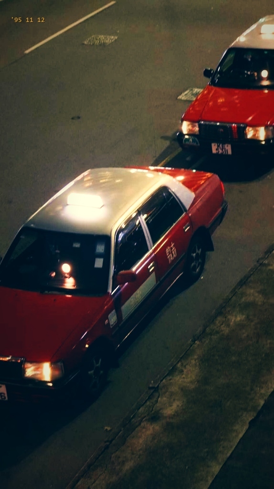
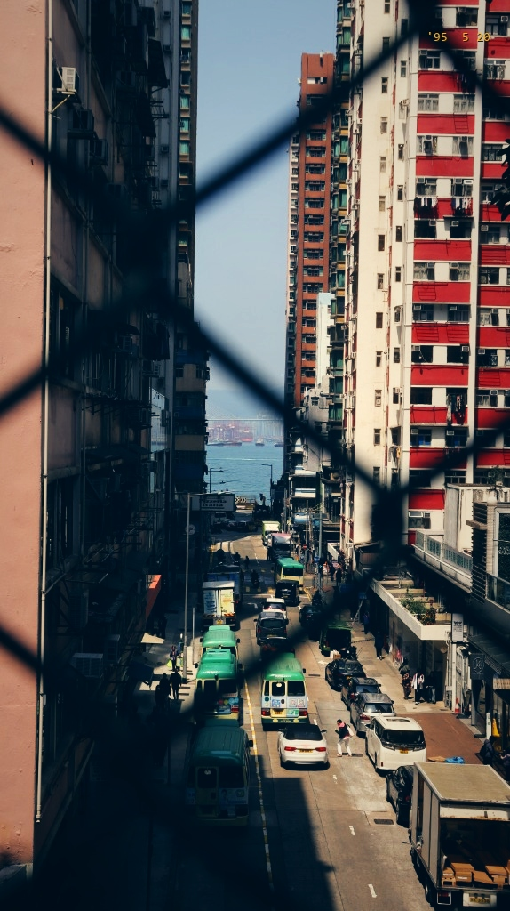

# 🎬 Wong Kar-wai Lens (王家卫镜头 / 港影工坊)

<p align="center">
  <b>基于杜可风摄影光学物理特性的 1990 年代香港电影胶片与王家卫风格重塑开源引擎</b><br>
  <i>Open-source Christopher Doyle optical physics & 1990s Hong Kong cinema film emulation engine for AI Agents and Python.</i>
</p>

<p align="center">
  
  
  
  
  
</p>

---

## 🌟 为什么它比普通滤镜更有“电影味”？(The Optical Science)

普通滤镜只是机械地调整饱和度与对比度，成片依然充满“手机数码味”。本引擎真正从**影视光学物理特性（Christopher Doyle Cinematography）**出发重构了 4 大核心维度：

1. 🏮 **黑柔滤镜发光与胶卷红晕（Black Pro-Mist Bloom & Halation）**：
   * 自动提取画面高光光源（车灯、灯笼、落日、反光），生成柔和浪漫的**雾状漫射光晕（Bloom）**，并在边缘渗透柯达胶片的**温暖微红晕（Red Halation）**，彻底消除数码生硬干涩。
2. 🎨 **柯达 Vision 500T / 2383 胶卷感光乳剂偏色（Kodak Film Matrix）**：
   * **暗部与阴影**：经典的《重庆森林》《堕落天使》**深孔雀青绿（Teal-Emerald）**。
   * **高光与灯光**：温润醇厚的**暖金琥珀色（Tungsten Amber）**。
   * **红色分离**：如《花样年华》旗袍与红色的士般的**浓郁深沉正红（Ruby Red）**。
3. 🎞️ **胶片 S 型层次与提亮黑位（Velvety Lifted Blacks）**：
   * 纯黑被平滑提亮为带灰绿调的丝绒质感，高光自然压缩不爆白。
4. ⏳ **90s 经典胶卷相机时间戳（Delicate Yellow Timestamp）**：
   * 角落点缀极简微小的黄色 LCD/LED 怀旧时间码（如 `'95 11 12` / `'96 11 08`）。

---

## 🖼️ 官方实战展厅 · 经典前后对比 (Before & After Showcase)

### 🚕 经典一 · 《弥敦道 · 红色的士》 (HK Red Taxis at Night)

<div align="center">
  <table>
    <tr>
      <th width="50%" align="center">📷 原始日常实拍 (Original Photo)</th>
      <th width="50%" align="center">🎞️ 港影胶片重塑 (WKW Film Grade)</th>
    </tr>
    <tr>
      <td align="center"></td>
      <td align="center"></td>
    </tr>
  </table>
</div>

> **【时间坐标】** `'95 11 12`  
> **【王家卫独白】** “在香港，每天有两万四千辆红色的士在路上跑。从尖沙咀到旺角，总共要拐十四个弯。那天晚上，我和前面那辆车最近的时候，距离只有两米。后来绿灯亮了，它向左转，我向右转。”

---

### 🌊 经典二 · 《坚尼地城 · 通往海的下坡路》 (Kennedy Town Slope to Sea)

<div align="center">
  <table>
    <tr>
      <th width="50%" align="center">📷 原始日常实拍 (Original Photo)</th>
      <th width="50%" align="center">🎞️ 港影胶片重塑 (WKW Film Grade)</th>
    </tr>
    <tr>
      <td align="center"></td>
    </tr>
  </table>
</div>

> **【时间坐标】** `'95  5 20`  
> **【王家卫独白】** “从坚尼地城的斜坡看下去，尽头就是大海。每天下午三点，绿色的十六座小巴会排着队往下开。我隔着铁丝网看了很久，以为只要顺着这条路一直走，就能走到世界尽头。”

---

## 🚀 快速上手 (Quick Start)

### 1. 一键安装 (Installation)

```bash
git clone https://github.com/bazz1111/wkw-lens.git
cd wkw-lens
pip install -e .
```

---

### 2. 命令行一键出片 (CLI Usage)

```bash
# 经典王家卫港影色调（带黑柔滤镜发光与胶卷红晕）
wkw-lens my_photo.jpg -t "'95 11 12"

# 夜景/街景模式
wkw-lens taxi.jpg -s night -t "'95 11 12" --pos top-left

# 暖金黄昏模式
wkw-lens sunset.jpg -s sunset -t "'97  7 01"
```

---

## 🤖 作为 AI Agent Skill 使用

本项目根目录下的 [`SKILL.md`](SKILL.md) 遵循 **Antigravity / Claude Code / Cursor / Open-Agents** 标准规范。

---

## 📜 开源协议 (License)

本项目采用 [MIT License](LICENSE) 开源协议。
