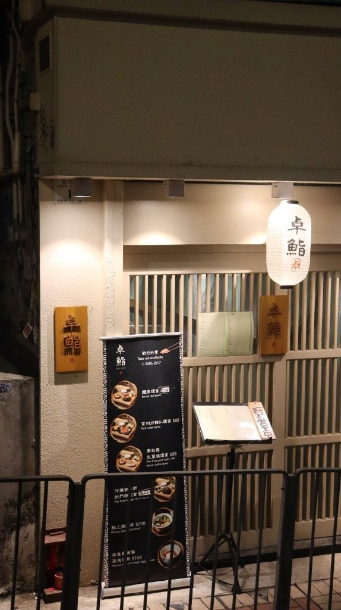
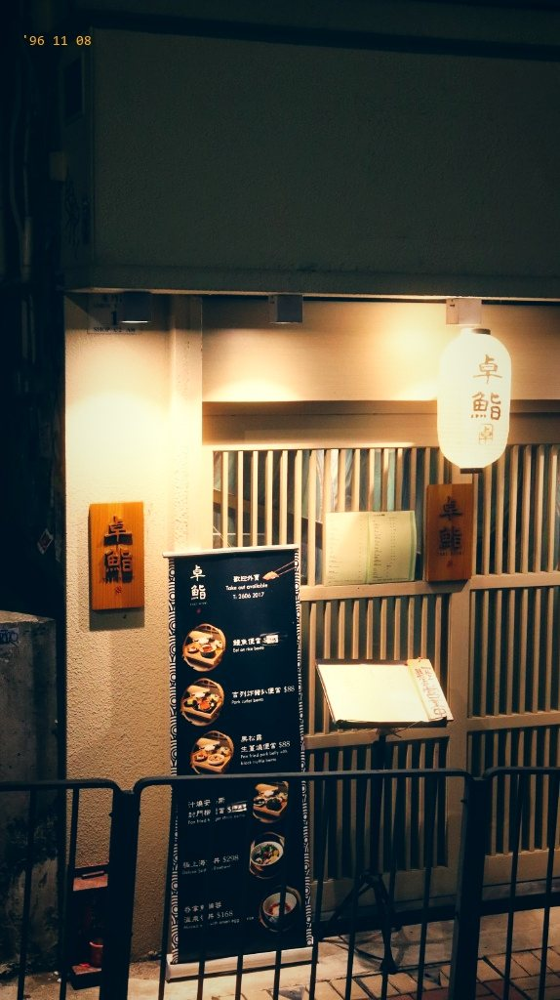
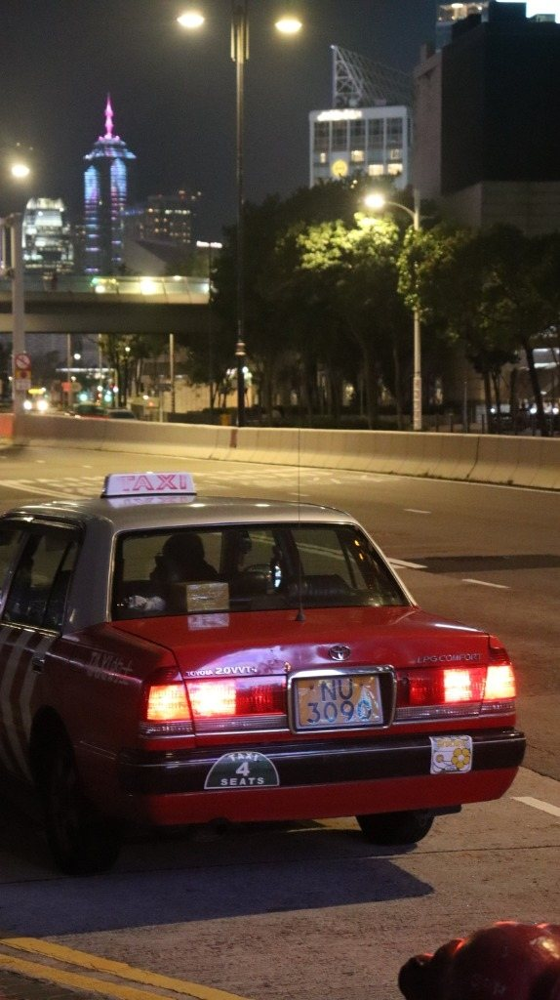
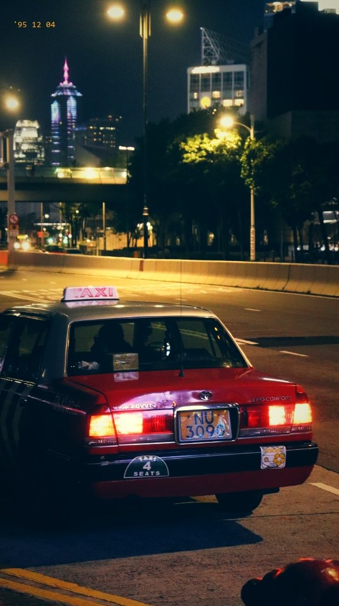
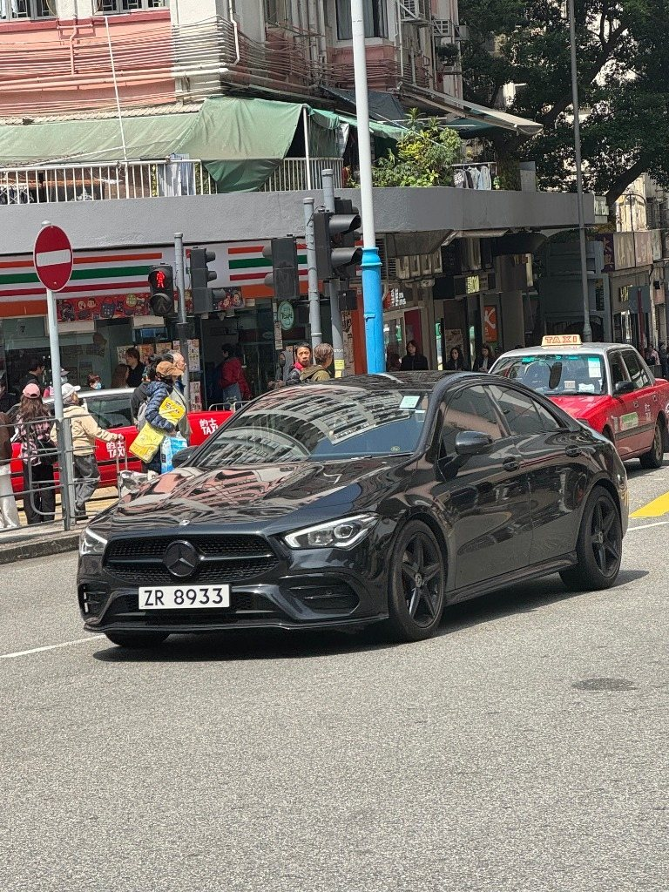
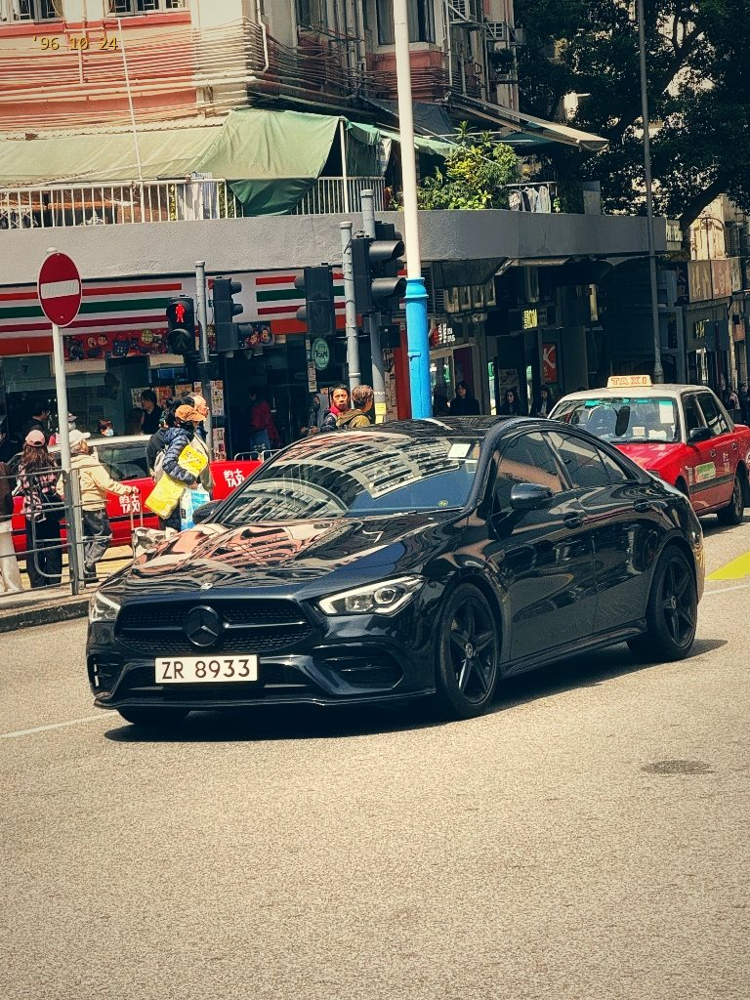
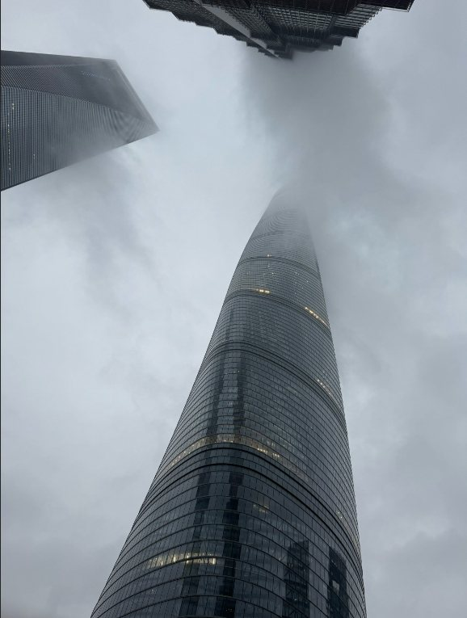
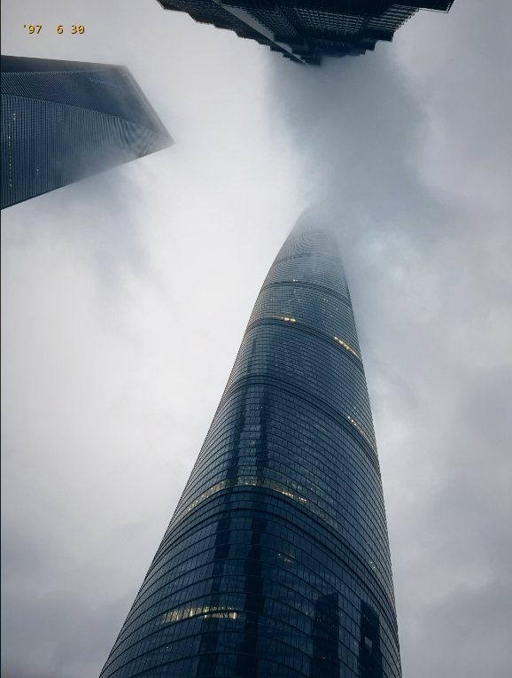
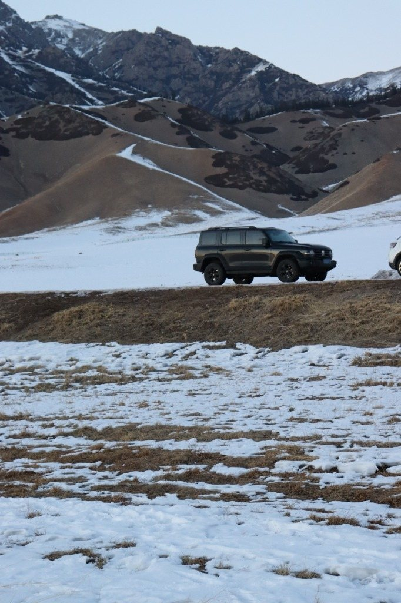
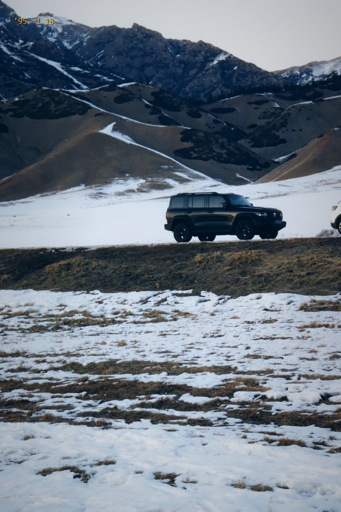

# 🎬 Wong Kar-wai Lens (王家卫镜头 / 港影工坊)

<p align="center">
  <b>专为 AI Agent 打造的 1990 年代香港电影摄影场景设计与王家卫美学重塑 Skill</b><br>
  <i>A plug-and-play AI Agent Skill & Python engine for transforming everyday photos into 1990s Hong Kong cinema art with authentic optical physics, Kodak film stock, and poetic monologues.</i>
</p>

<p align="center">
  
  
  
  
  
</p>

---

## 🤖 1. AI Agent 一键安装与调用指南 (Agent Quickstart)

本项目核心定位为一个**标准遵循、文档驱动的 AI Agent Skill**（规范兼容 Antigravity / Claude Code / Cursor / Windsurf / Open-Agents / GPTs）。

它能让你的 AI Agent 瞬间具备**顶级电影摄影师（杜可风/王家卫）的画面分析能力、光学器材参数生成能力与粤语电影独白创作能力**。

```
┌─────────────────┐       ┌──────────────────────┐       ┌────────────────────────┐
│  用户上传日常照   │ ───>  │  wong-kar-wai-lens   │ ───>  │  1. 杜可风光学参数配方  │
│ (街景/人像/黄昏) │       │      Agent Skill     │       │  2. 柯达500T胶片色彩    │
└─────────────────┘       └──────────────────────┘       │  3. 90s复古黄色时间戳  │
                                                         │  4. 王家卫中英电影独白  │
                                                         └────────────────────────┘
```

---

### 📦 1.1 主流 AI 平台一键安装

#### 🌟 方式 A：Google Antigravity / Open-Agents（推荐）
直接将本项目克隆至 Agent 的全局技能配置目录中：

```bash
# Windows
git clone https://github.com/bazz1111/wkw-lens.git %USERPROFILE%\.gemini\config\skills\wkw-lens

# macOS / Linux
git clone https://github.com/bazz1111/wkw-lens.git ~/.gemini/config/skills/wkw-lens
```
> 安装完成后，Agent 在启动时会自动加载该技能，直接在对话框中唤醒即可。

---

#### 🌟 方式 B：Claude Code / Cursor / Windsurf / Qoder
* **在 Cursor / Windsurf 中**：在项目根目录创建 `.cursorrules` 或 `.windsurfrules`，直接把本仓库根目录下的 [`SKILL.md`](SKILL.md) 内容复制进去作为全局上下文。
* **在 Claude Code 中**：
  ```bash
  git clone https://github.com/bazz1111/wkw-lens.git ~/.claude/skills/wkw-lens
  ```

---

#### 🌟 方式 C：Dify / Coze / Custom GPTs / 独立工作流
1. 打开你的 Agent 或 GPTs 配置后台（System Prompt / Knowledge）；
2. 上传本仓库的 [`SKILL.md`](SKILL.md) 与 [`prompts/cinematography_optics_guide.md`](prompts/cinematography_optics_guide.md)；
3. 将下方的**「指令模版」**作为 Agent 的核心技能描述。

---

### 💬 1.2 如何在对话中调用 AI？(Prompt Examples)

安装好 Skill 后，你可以用非常自然的语言直接与 AI 对话：

#### 示例 1：街景重塑与独白生成
> **用户**：“`@wkw-lens` 分析我刚上传的这张香港街角出租车照片，生成一段王家卫式的内心独白，并给出电影级 Midjourney / Flux 重绘提示词。”  
> **AI 响应**：
> * 自动解析构图与夜景光影；
> * 匹配摄影硬件：`ARRIFLEX 535B + Zeiss 28mm T1.3 + Kodak Vision3 500T`；
> * 输出带精确时间戳与微观距离的王家卫独白；
> * 生成带黑柔滤镜发光、红晕与青冷沥青影调的 35mm 胶片画面。

#### 示例 2：纯本地 Python 工具一键执行
> **用户**：“帮我把 `my_photo.jpg` 用 wkw-lens 脚本转成 90 年代港影色调，时间戳设为 `'95 11 12`。”  
> **AI 响应**：
> * 自动调用 `python -m src.cli my_photo.jpg -s night -t "'95 11 12"` 完成渲染输出。

---

## 🖼️ 2. 官方实战展厅 · 7 大场景前后对比 (Before & After Showcase)

### 🏮 场景 1 · 《深夜食堂 · 卓鮨的灯笼》 (Midnight Lantern)

<div align="center">
  <table>
    <tr>
      <th width="50%" align="center">📷 原始日常实拍 (Original Photo)</th>
      <th width="50%" align="center">🎞️ 港影胶片重塑 (WKW Film Grade)</th>
    </tr>
    <tr>
      <td align="center"></td>
      <td align="center"></td>
    </tr>
  </table>
</div>

> **【器材配方】** `ARRI ALEXA 35 + Zeiss Super Speed 28mm T1.3 + 2800K 暖钨丝灯 + Pro-Mist Bloom 光晕漫射`  
> **【时间坐标】** `'96 11 08`  
> **【王家卫独白】** “这盏白色的灯笼每天晚上六点亮起来，凌晨一点熄灭。我常常坐在门外的栏杆上看里面的人进进出出。有些人是为了填饱肚子，有些人只是害怕一个人回家。”

---

### 🌅 场景 2 · 《落日海鸥 · 飞过水面的影子》 (Golden Sunset & Seagulls)

<div align="center">
  <table>
    <tr>
      <th width="50%" align="center">📷 原始日常实拍 (Original Photo)</th>
      <th width="50%" align="center">🎞️ 港影胶片重塑 (WKW Film Grade)</th>
    </tr>
    <tr>
      <td align="center"></td>
      <td align="center"></td>
    </tr>
  </table>
</div>

> **【器材配方】** `Aaton XTR Super 16 + Leica Summilux 35mm T1.4 + Kodak Ektachrome 100D + 3000K 金色逆光`  
> **【时间坐标】** `'97  7 01`  
> **【王家卫独白】** “太阳落下去需要八分钟，海鸥飞过水面只需要两秒。在那个黄昏，我数到第七十四只海鸥的时候，天已经彻底暗了。有些事情发生得很快，快到你连遗忘的时间都没有。”

---

### 🚕 场景 3 · 《弥敦道 · 红色的士》（俯拍街景） (HK Red Taxis Night)

<div align="center">
  <table>
    <tr>
      <th width="50%" align="center">📷 原始日常实拍 (Original Photo)</th>
      <th width="50%" align="center">🎞️ 港影胶片重塑 (WKW Film Grade)</th>
    </tr>
    <tr>
      <td align="center"></td>
      <td align="center"></td>
    </tr>
  </table>
</div>

> **【器材配方】** `ARRIFLEX 535B + Zeiss 28mm T1.3 + Kodak Vision3 500T + 车顶灯红晕 + 湿沥青幽青暗部`  
> **【时间坐标】** `'95 11 12`  
> **【王家卫独白】** “在香港，每天有两万四千辆红色的士在路上跑。从尖沙咀到旺角，总共要拐十四个弯。那天晚上，我和前面那辆车最近的时候，距离只有两米。后来绿灯亮了，它向左转，我向右转。”

---

### 🚕 场景 4 · 《夜行的士 · NU 3090》（追尾视角） (Midnight Taxi Rear View)

<div align="center">
  <table>
    <tr>
      <th width="50%" align="center">📷 原始日常实拍 (Original Photo)</th>
      <th width="50%" align="center">🎞️ 港影胶片重塑 (WKW Film Grade)</th>
    </tr>
    <tr>
      <td align="center"></td>
      <td align="center"></td>
    </tr>
  </table>
</div>

> **【器材配方】** `ARRIFLEX 535B + Zeiss 50mm T1.3 + Kodak 500T + 尾灯高光扩散 Halation`  
> **【时间坐标】** `'95 12 04`  
> **【王家卫独白】** “这辆车牌号是 NU 3090 的红色的士，车顶灯在深夜里亮得很扎眼。在香港的深夜，总有一些人坐着它去往某个人的身边，也总有一些人坐着它离开。车尾灯亮起来的时候，我知道又一段故事结束了。”

---

### 🚗 场景 5 · 《街角便利店 · 红绿灯下的停顿》 (Corner 7-Eleven & Mercedes)

<div align="center">
  <table>
    <tr>
      <th width="50%" align="center">📷 原始日常实拍 (Original Photo)</th>
      <th width="50%" align="center">🎞️ 港影胶片重塑 (WKW Film Grade)</th>
    </tr>
    <tr>
      <td align="center"></td>
      <td align="center"></td>
    </tr>
  </table>
</div>

> **【器材配方】** `ARRI ALEXA 35 + Zeiss 35mm T1.4 + 饱和 7-11 红与高反差街景`  
> **【时间坐标】** `'96 10 24`  
> **【王家卫独白】** “在七十一便利店门口，红灯会亮四十五秒。那辆黑色的奔驰停在斑马线前，后面紧跟着一辆红色的士。在那个下午，我和那辆车最近的时候只有三米。四十五秒之后，绿灯亮了，大家都急着赶去下一个地方。”

---

### 🏢 场景 6 · 《仰望高塔 · 雾中的城》 (Tower in the Mist)

<div align="center">
  <table>
    <tr>
      <th width="50%" align="center">📷 原始日常实拍 (Original Photo)</th>
      <th width="50%" align="center">🎞️ 港影胶片重塑 (WKW Film Grade)</th>
    </tr>
    <tr>
      <td align="center"></td>
      <td align="center"></td>
    </tr>
  </table>
</div>

> **【器材配方】** `ARRIFLEX 535B + Cooke 18mm T2.0 超广角 + 沉郁青灰冷调迷雾`  
> **【时间坐标】** `'97  6 30`  
> **【王家卫独白】** “一九九七年六月三十日，大雾。我站在楼底下往上看，整座大厦的顶端都插在云里面。我不知道上面住着什么样的人，但在雾散开之前，这里安静得像是一个没人知道的秘密。”

---

### 🏔️ 场景 7 · 《雪原孤车 · 山脉的尽头》 (Solitary Snow Mountain)

<div align="center">
  <table>
    <tr>
      <th width="50%" align="center">📷 原始日常实拍 (Original Photo)</th>
      <th width="50%" align="center">🎞️ 港影胶片重塑 (WKW Film Grade)</th>
    </tr>
    <tr>
      <td align="center"></td>
      <td align="center"></td>
    </tr>
  </table>
</div>

> **【器材配方】** `ARRI ALEXA 35 + Angénieux 28-76mm T2.6 + 柯达 2383 正片偏色 + 压低死白`  
> **【时间坐标】** `'95  1 18`  
> **【王家卫独白】** “以前我认为翻过这座雪山，就能看到另一番天地。等我开着车真正到了山顶，才发现另一边不过是更多的雪和更大的风。但既然已经停在了这里，就索性坐下来抽完这支烟。”

---

## 🔬 3. 杜可风电影光学物理原理解析 (The Optical Science)

1. 🏮 **黑柔滤镜发光与胶卷红晕（Black Pro-Mist Bloom & Halation）**：
   * 自动提取画面高光光源（车灯、灯笼、落日、反光），生成柔和浪漫的**雾状漫射光晕（Bloom）**，并在边缘渗透柯达胶片的**温暖微红晕（Red Halation）**。
2. 🎨 **柯达 Vision 500T / 2383 胶卷感光乳剂偏色（Kodak Film Matrix）**：
   * **暗部与阴影**：经典的《重庆森林》《堕落天使》**深孔雀青绿（Teal-Emerald）**。
   * **高光与灯光**：温润醇厚的**暖金琥珀色（Tungsten Amber）**。
   * **红色分离**：如《花样年华》旗袍与红色的士般的**浓郁深沉正红（Ruby Red）**。
3. 🎞️ **胶片 S 型层次与提亮黑位（Velvety Lifted Blacks）**：
   * 纯黑被平滑提亮为带灰绿调的丝绒质感，高光自然压缩不爆白。
4. ⏳ **90s 经典胶卷相机时间戳（Delicate Yellow Timestamp）**：
   * 角落点缀极简微小的黄色 LCD/LED 怀旧时间码（如 `'95 11 12` / `'96 11 08`）。

---

## 🛠️ 4. 纯本地 Python 命令行与代码调用 (CLI & API)

### 4.1 本地一键安装
```bash
git clone https://github.com/bazz1111/wkw-lens.git
cd wkw-lens
pip install -e .
```

### 4.2 命令行出片 (CLI Usage)
```bash
# 经典王家卫港影色调（带黑柔滤镜发光与胶卷红晕）
wkw-lens my_photo.jpg -t "'95 11 12"

# 夜景/街景模式
wkw-lens taxi.jpg -s night -t "'95 11 12" --pos top-left

# 暖金黄昏模式
wkw-lens sunset.jpg -s sunset -t "'97  7 01"
```

### 4.3 Python API 调用
```python
from PIL import Image
from src.color_grading import grade_image
from src.candid_processor import add_delicate_timestamp

# 打开照片并进行港风调色
img = Image.open("taxi.jpg")
graded = grade_image(img, style="night")

# 添加 90s 复古时间戳
final_img = add_delicate_timestamp(graded, timestamp_str="'95 11 12", position="top-left")
final_img.save("output_taxi_wkw.jpg", quality=98)
```

---

## 📜 开源协议 (License)

本项目采用 [MIT License](LICENSE) 开源协议。
